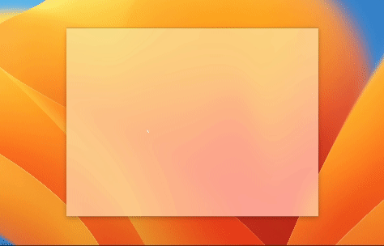

# Tauri macOS Hello
A basic Tauri app that mimics Apple's iconic 'Hello' text. Personal experiment project.

## Why does this exist?
This app only exists as a personal attempt to recreate the effect out of shear boredom. It isn't meant to be a proper app, but I have released it for anyone curious on how to do the effect, or are just bored themselves lol.

## Building And Running
Designed for execution on macOS, but should run fine on other platforms due to the shear simplicity of this project. Just run it like any other tauri app inside of the `macos-hello` directory. 

## Features
- Translucent window
- Animated hello text
- Drag window
- Very apple-y 
- Life changing (ok maybe not this one)

## Preview

For best demo, run locally. The gif above is a very low fps and undermines the animation.

## License
MIT. I don't really care what you do with this or it's code. You should probably not use the hello text though, as it belongs to Apple.

**Not licensed, created by, or endorsed by Apple**